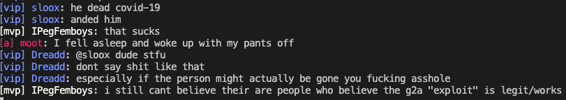

# Hi!

This is the first client for the raidforums shoutbox on GitHub.
You can do (almost) everything with this client. This includes sending and receiving
messages, seeing all emojis and enjoying the toxicity. Furthermore, you can also set a custom
signature that will be behind each message.

## How do I use the client?

0) create a raidforums.com account, if you dont already have one.

1) clone this repo by typing `git clone https://github.com/wwhtrbbtt/pyRFSB.git`
2) enter the directory by doing the same with `cd pyRFSB`
You should be in the downloaded directory now.
3) download the requirements by executing `pip install beautifulsoup4 websocket_client`

Now you are almost good to go. The only thing left is extracting your token from RaidForums.
To do this, follow these steps:

1) open a new tab on chrome.
2) open the developer tools by pressing Option + ⌘ + J (on macOS), or Shift + CTRL + J (on Windows/Linux). Make the window a bit bigger.
3) Now, go to the _network_ tab. If you found it, change your selection from _all_ to _ws_
4) open raidforums.com
5) There should be a single new request. Press on that request, scroll all the way down in the
_headers_ tab. There should be your token, right under Query String Parameters. Now copy that token and paste it in the settings.json file

Now, just start the main.py file by typing `python3 main.py`. Now you can start to communicate with your 3lit3 h4xx0r friends!

## What are the commands?

You can see all avaiable commands by typing /commands. This message wont be send.
the commands are:

- /open - open raidforums.com in your browser
- /emojis - see all available emojis
- /commands - see all available commands

## What are the limitations?

There are a few small limitations.

- Some roles might not be implemented correctly, and will just be white.
- The colored ranks/messages arent the same color as on raidforums
- You cant see any edits on messages, or edit any messages
- There is a small risk of being timed out, only had it once after an 8h test run.